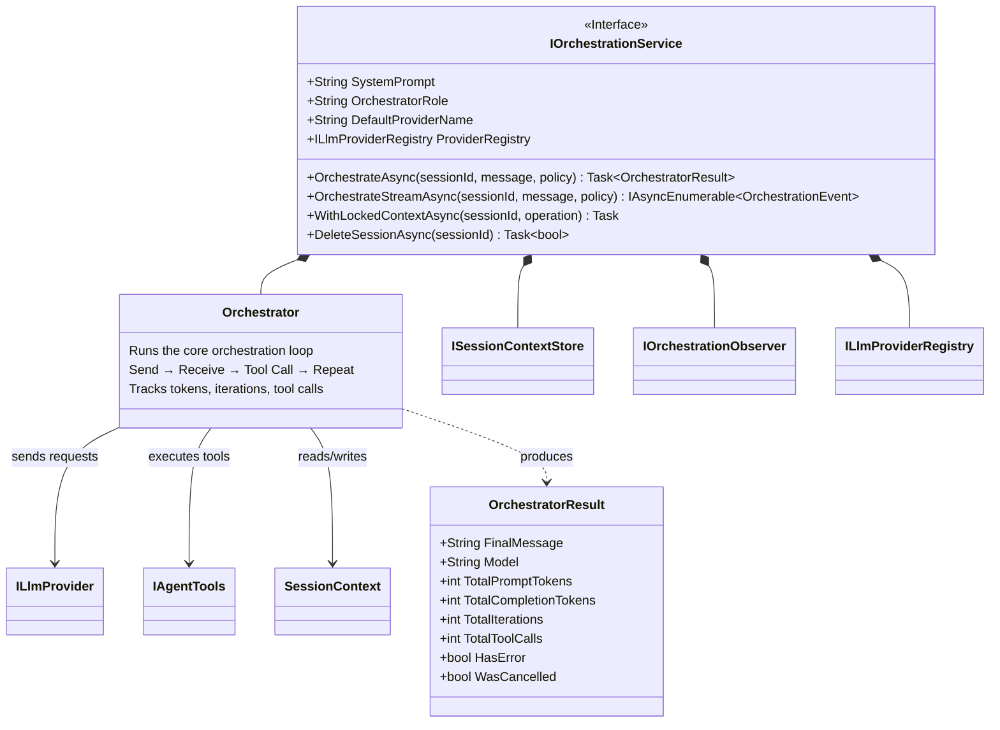
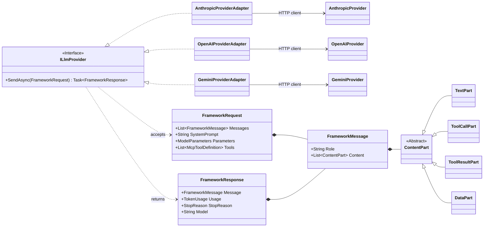
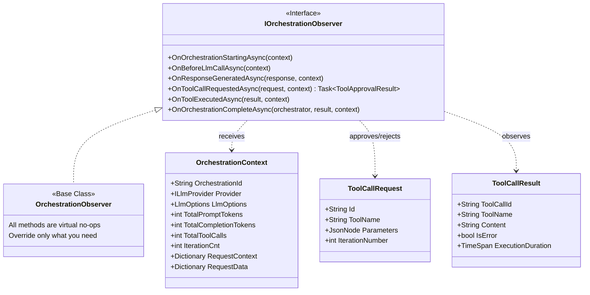
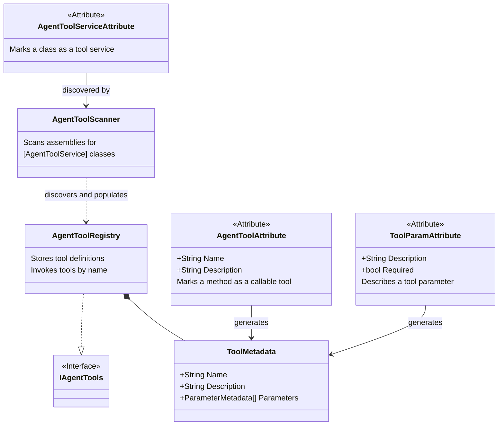

# Architecture Overview

Saucer.AI is organized around a small number of well-defined interfaces. Rather than deep class hierarchies, components are composed through configuration — each orchestration service is assembled from a provider, a context store, an observer, and a tool set.

## Core Components

## Provider Abstraction

All LLM providers implement `ILlmProvider`. The framework layer defines provider-agnostic message types — `FrameworkRequest`, `FrameworkResponse`, `FrameworkMessage`, and `ContentPart`. Provider-specific details never leak beyond the adapter boundary.

This is what enables mid-conversation provider switching. The context window holds `FrameworkMessage` objects, not provider-specific types.

## Observer Pipeline

Observers participate in every phase of the orchestration lifecycle. The base `OrchestrationObserver` class provides virtual no-op methods so implementations only need to override what they care about.

## Agent Tools

Tools are regular C# classes discovered by attribute scanning. The framework handles schema generation, parameter binding, and invocation. Tools execute locally in-process.

## Design Principles

- **Composability over inheritance** — Features are assembled through builder configuration, not deep class hierarchies.
- **Transparency over convenience** — The DI configuration describes the full agent architecture. Nothing is hidden behind defaults that are hard to discover.
- **Standard .NET patterns** — `IServiceCollection`, keyed services, options pattern, `IAsyncEnumerable`. If you know ASP.NET Core, you already know how to use Saucer.AI.
- **Provider agnosticism at the core** — Business logic never touches provider-specific types. Switching providers is a configuration change, not a code change.
